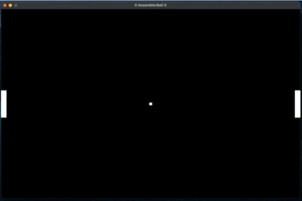

# AssemblerBall

#### 2D game written in ARM Assembly with SDL2



### Git

```shell
git clone https://github.com/bontail/AssemblerBall.git
```

### Run

To run the game, you will need to have SDL2 library installed on your system.<br>
You can install this library using your system's package manager or by downloading them from their respective websites.<br>
Also required Cmake.

```shell
mkdir build && cd build
cmake .. && cmake --build .
./AssemblerBall
```